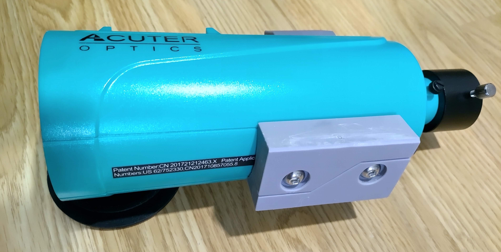

# MaksyDovetail : MAKSY60用簡易アリガタ
Dovetail Plate for ACUTER OPTICS MAKSY60

## 説明
サイトロンジャパンで扱っている[ACUTER OPTICS MAKSY60](https://www.sightron.co.jp/product/maksy60-newtony.html)用のアリガタです。
MAKSY GO 60は丁度良いアリガタが組みつけられて販売されていますが、このパーツは単体で入手できません。
市販のアリガタを付けるのも良いですが、ちょっと大げさな感じです。そのため3Dプリンタ用のパーツを作りました。

パーツが左右分割されているのは、アリミゾのクランプ力を逃がすためです。内側側面に両面テープを付け、ネジはあまり締め付けなくて良いかと思います。

なお、写真は一つ前のバージョンの試作版で若干の差異があります。ここに公開した設計図のバージョンはまだプリントして試していないので何か問題があるかもしれません。自己責任で使用してください。

[MaksyDovetail.stl](./MaksyDovetail.stl) (3Dビューアでモデルを見る)

## ライセンス
* [TAPR Open Hardware License (OHL)](https://tapr.org/the-tapr-open-hardware-license/)
  * https://files.tapr.org/OHL/TAPR_Open_Hardware_License_v1.0.txt
* 
  * https://creativecommons.org/licenses/by-sa/4.0/

